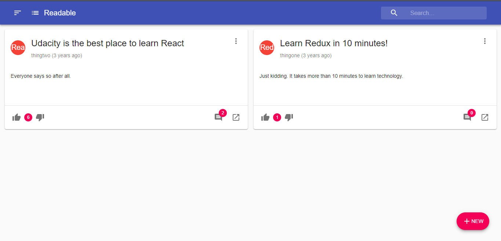
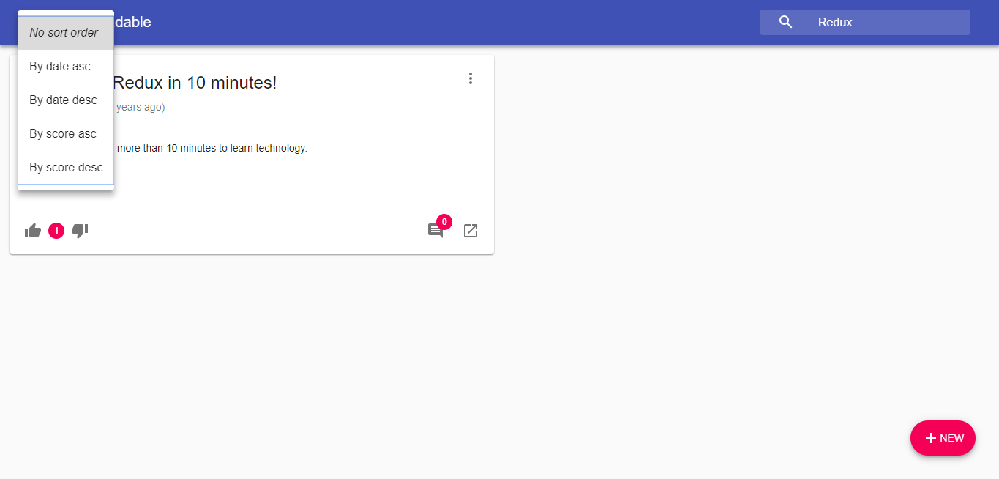
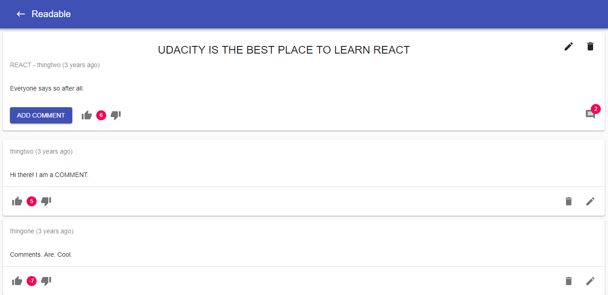

### Readable
This is a React project developed for the Udacity React Nano degree.

### Prerequisites
To run this project, you will need to have this (https://github.com/udacity/reactnd-project-readable-starter) server running.
To run the server clone the project from github, install dependencies and run it:
```
git clone https://github.com/udacity/reactnd-project-readable-starter.git
cd api-server
npm install
node server
```    

### How to Run the App
With the NodeJs installed clone this project, install dependencies and start a sever.

```
git clone https://github.com/henriquebk1/Readabl-Udacity.git
npm install
npm start
```
After that a new browser should automatically open displaying the app or you can navigate to http://localhost:3000/ in your browser

### Libraries used:
Redux
Redux Thunk
React Router V4
Material-UI
moment
UUID
React
and more...

### Screenshots




